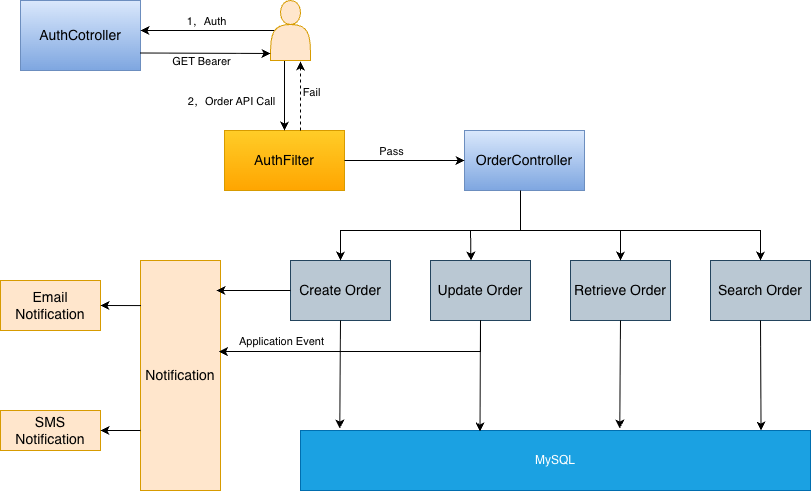
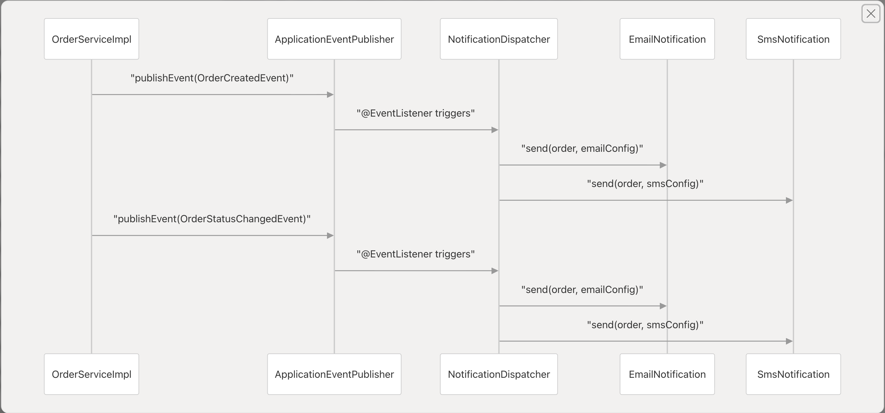
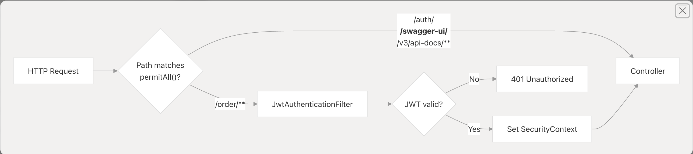
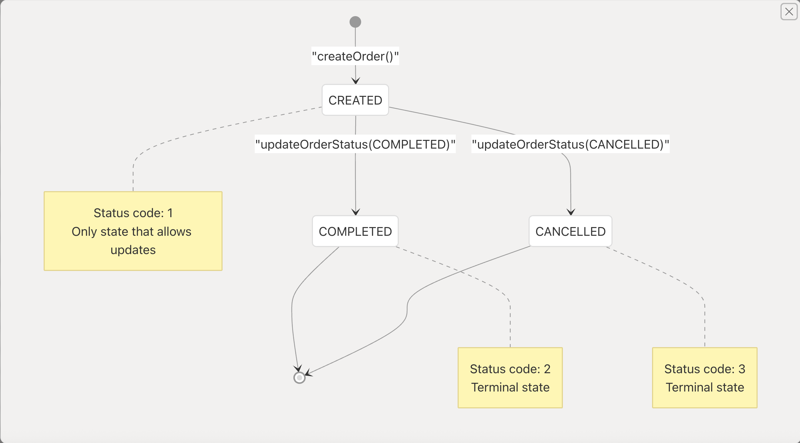
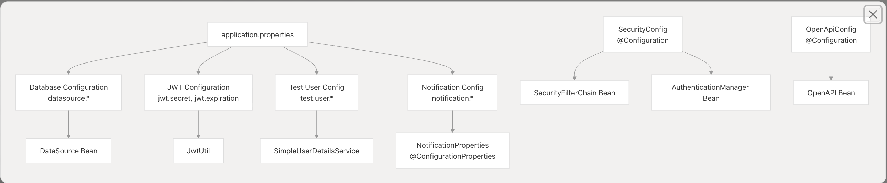

# A simple order system

## System Purpose
The order management system is a Spring Boot-based REST API that provides secure order lifecycle management with integrated notification capabilities. The system enables authenticated clients to create orders, track their status through defined states, and receive notifications when order events occur. The architecture emphasizes security, extensibility, and maintainability through clean separation of concerns and event-driven design.

## Architecture
### Overall Architecture

### Event Driven Architecture

### Security Filter Chain

### Order State Machine

### Configuration Hierarchy

## Technology Stack
The system is built on the following technologies and frameworks:

### Core Framework
* <strong>Spring Boot 4.0.1</strong>: Application framework and dependency injection container
* <strong>Java 25</strong>: Programming language

### Data Persistence
* <strong>Spring Data JPA</strong>: Data access layer for interacting with the database
* <strong>Hibernate ORM</strong>: ORM implementation
* <strong>MySQL</strong>: Relational database (via mysql-connector-j)

### Security
* <strong>Spring Security</strong>: Authentication and authorization framework
* <strong>JWT (0.11.5)</strong>: JWT token generation and validation

### API and Documentation
* <strong>Spring Web(spring-boot-starter-web)</strong>: REST API implementation
* <strong>Springdoc OpenAPI (2.2.0)</strong>: API documentation generation and Swagger UI

### Validation and Utilities
* <strong>Jakarta Validation (spring-boot-starter-validation)</strong>: Request validation
* <strong>Lombok</strong>: Boilerplate reduction for Java classes

## Why Decision Made
### Why use Spring Event to implement notification system?
* It's too heavy to introduce a full-fledged message broker like RabbitMQ or Kafka for this simple order system.
* Spring Events allow for easy integration with existing Spring components and leverage the existing application context, making
 it simpler to manage and maintain the notification system without adding external dependencies.

### Why use JWT for authentication?
* JWTs are stateless and self-contained, allowing for scalable authentication without the need for server-side session storage.
* They can be easily integrated into RESTful APIs, providing a secure way to transmit user information between the client and server.
* JWTs support claims, enabling the inclusion of additional user information and permissions within the token itself.

### Why use MySQL as the database?
* MySQL is a widely-used, reliable, and well-supported relational database that fits the needs
  of this order management system, providing robust data integrity and transactional support.
* It can provide data filtering and pagination capabilities at the database level, reducing the need for complex data processing in the application layer.

### Why use State Machine to manage order states?
* State machines provide a clear and structured way to manage complex state transitions, ensuring that orders can only move between valid states.
* They enhance code readability and maintainability by encapsulating state logic, making it easier to understand and modify the order lifecycle.
* State machines facilitate debugging and testing by providing a well-defined framework for handling state changes and transitions.

